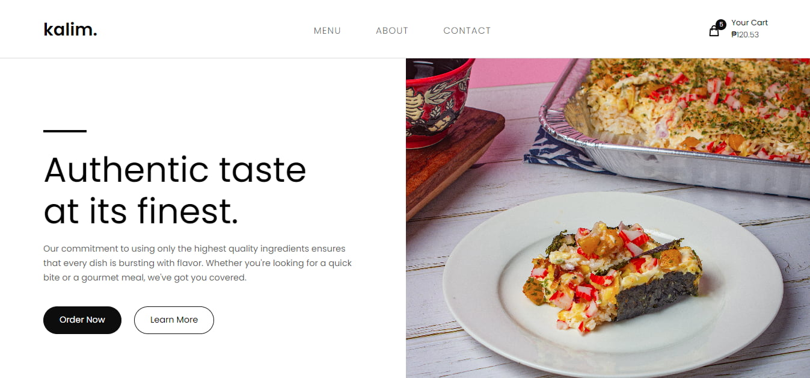

## Installation

1. Clone the repository

```
git clone https://github.com/rvitality/kalim.git .
```

2. Install the dependencies

```
npm install
```

3. Run the server. Do note that the server runs on port 3000.

```
npm run dev
```
